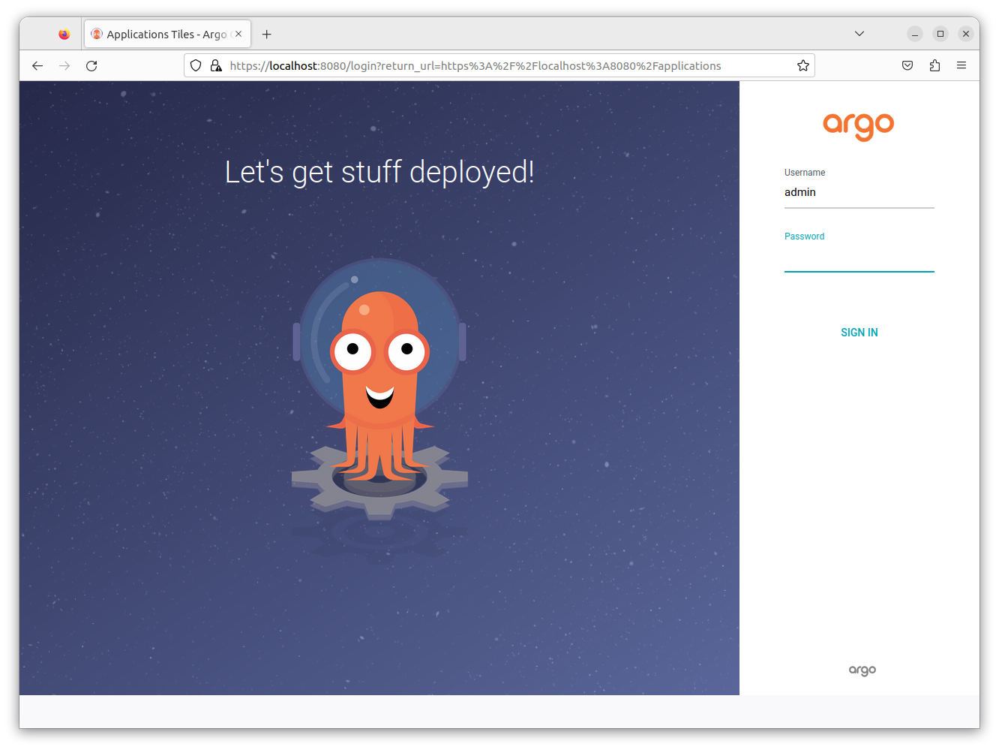
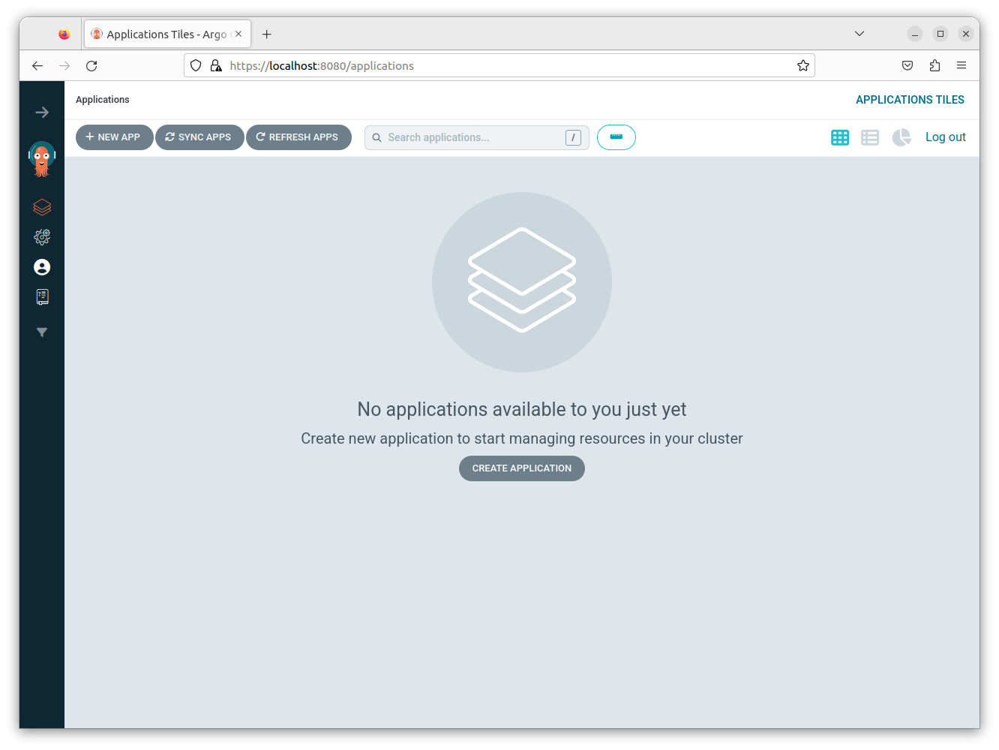
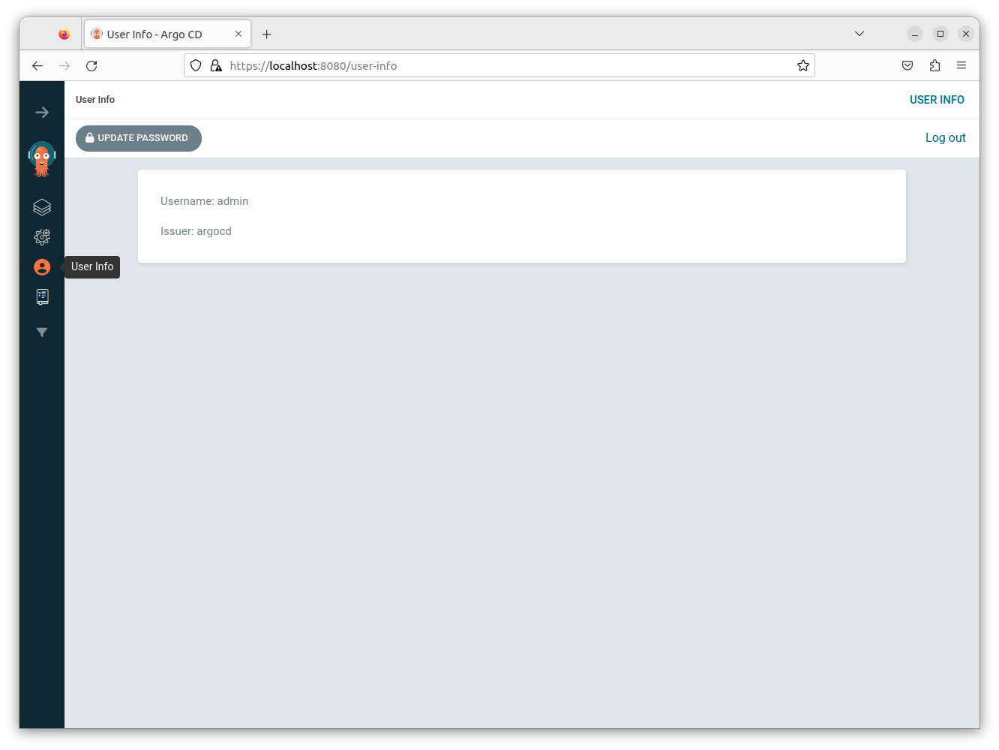



**ArgoCD** встановлена та налаштований проксі на неї з порта 8080.
Тобото для доступу до **ArgoCD** потрібно в браузері в строку адреси ввести *localhost:8080*

Попередньо згенеровнаний пароль для логіну "**admin**" - 'AG15Afen4wyn0sQP', 

Виконавши вхід в **ArgoCD** ви потрапляєте до робочого середовища.

З міркувань безпеки та зручності, згенерований пароль потрібно змінити.
Це можна зробити в розділі "**User info"**, натиснувши кнопку на бічній панелі.

